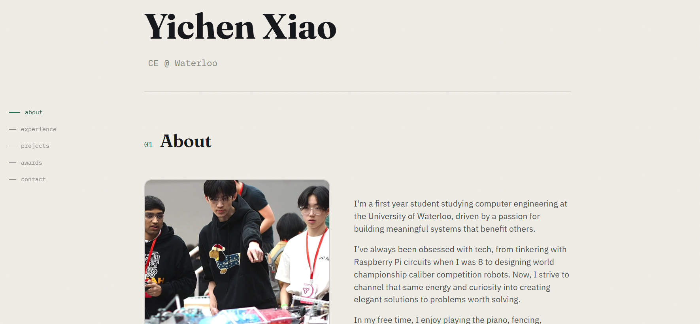

# Personal Website

> My professional personal portfolio website, including a rundown of my technical experience, personal projects, achievements, and contact methods

## What is this?

This is my personal portfolio website, built with Vite + React + Typescript. The design of the site reflects my clean and minimalistic aesthetic, featuring light tones, a single-page layout, a solid color background, and subtle animations that make the experience smoother without being too "in your face". The ultimate goal was to create a space that is both professional and personal, showing others who I am and what I do.

## Why did I make this?

Having a personal website is a great way to show employers more about myself as a person, beyond just a resume. As I prepare to seek internships and coops throughout my university years, this portfolio will allow me to demonstrate my creativity alongside my ability to ship products from start to finish. In the future, I hope to add an interactive CLI mode, where users type in commands to navigate to different sections of the site, showcasing my love for fun, intuitive UXs.

But beyond simply impressing others, there's also something deeply satisfying and rewarding about having a clean, organized space that showcases my projects, achievements, and overall personal growth. To me, this website also serves as documentation of my ongoing journey as a developer, and it's something I can look back on to see how far I've come, and how much further I have to go.

## How to use it

Visit yichenxiao.vercel.app to view my website. Note that the CLI mode is not yet built, and leads to a "coming soon" page for now.
